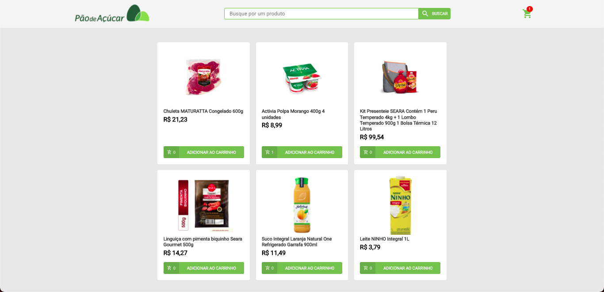

<div id="top"></div>
<!-- PROJECT LOGO -->
<br />
<div align="center">
  <h3 align="center">Serratec Ecommerce</h3>
</div>

<!-- ABOUT THE PROJECT -->
## Sobre o Projeto



Trabalho final da disciplina de React do curso de FullStack Serratec 2021.2

<!-- GETTING STARTED -->
## Instalação

Para executar o Projeto siga esses passos.

1. Clone o repositório

 ```sh
 git clone https://github.com/juniorcost4/serratec-ecommerce.git
 ```
2. Instale os pacotes do projeto
  
  * npm
    ```sh
    npm install
    ```

  * yarn
    ```sh
    yarn
    ```
    
3. Execute o projeto
  
  * npm
    ```sh
    npm run dev
    ```

  * yarn
    ```sh
    yarn dev
    ```

<p align="right">(<a href="#top">back to top</a>)</p>
